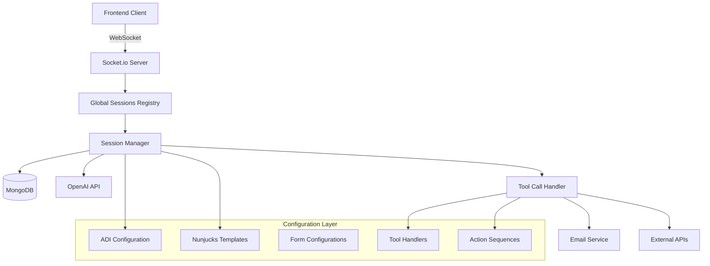
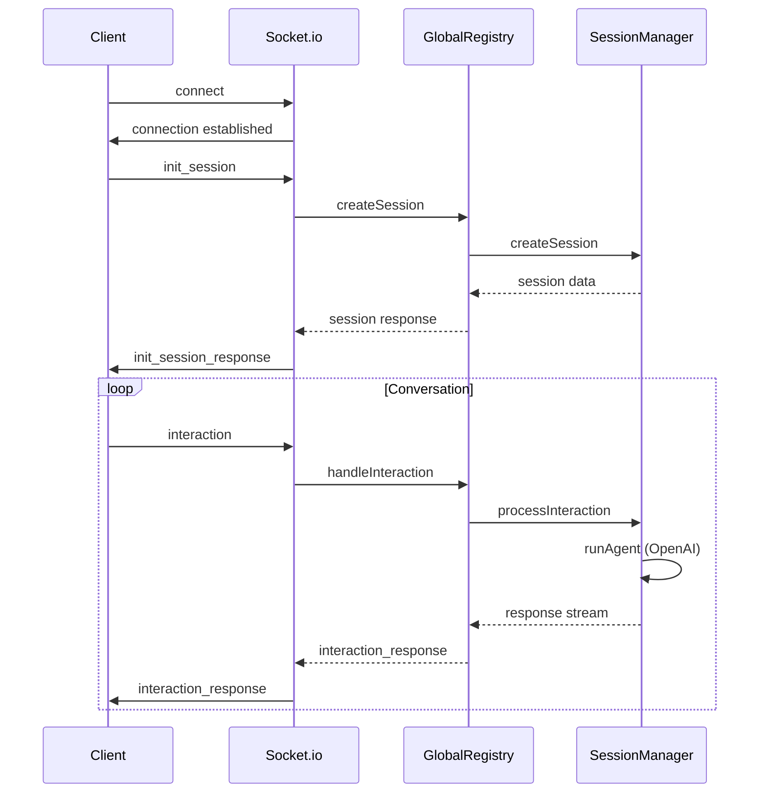
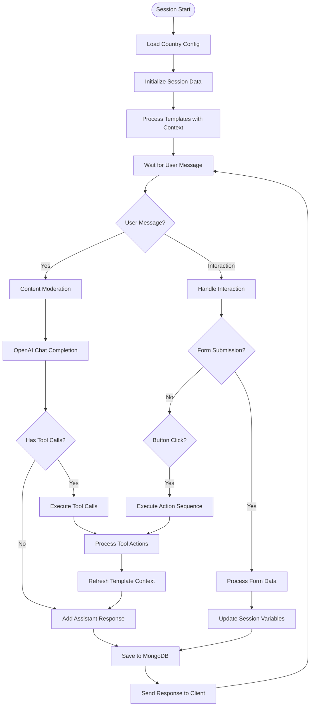
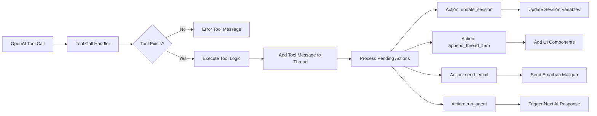
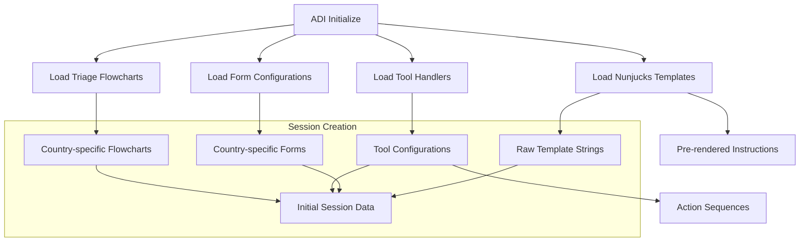
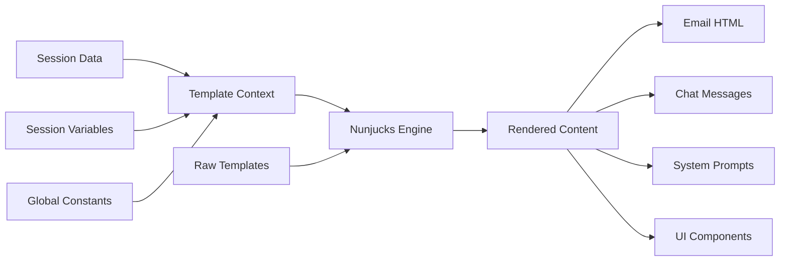

# Current Architecture Overview

## System Summary

This is a **Node.js/TypeScript backend** that provides an AI-powered conversational assistant for property management. The system handles real-time conversations via WebSocket, manages persistent sessions with MongoDB, and integrates with various external services.

## High-Level Architecture

## Core Components

### 1. Application Layer (`src/app.ts`)

**Purpose**: Main Express.js server with Socket.io WebSocket handling
- HTTP server setup with Express
- Socket.io configuration for real-time communication
- IP filtering and connection management
- Event handling for session lifecycle

### 2. Session Management Layer

#### Global Sessions Registry (`src/session/global-sessions-registry.ts`)
**Purpose**: Orchestrates multiple session managers by country/organization
- Manages country-specific session managers (UK, Canada)
- Handles client organization routing based on subdomain
- Coordinates session creation, disconnection, and reconnection

#### Session Manager (`src/session/sessions-manager.ts`)
**Purpose**: Manages individual conversational sessions
- **Session Lifecycle**: Create, persist, restore, disconnect
- **AI Integration**: OpenAI chat completions with tool calling
- **Template Processing**: Nunjucks template rendering with context
- **Thread Management**: Conversation history with metadata
- **MongoDB Persistence**: Automatic session storage and retrieval

### 3. Tool System Architecture

#### Tool Call Handler (`src/session/tool-call-handler.ts`)
**Purpose**: Executes OpenAI function calls and associated actions
- **Tool Execution**: Maps OpenAI tool calls to configured handlers
- **Action Processing**: Executes sequences of actions (update session, send email, etc.)
- **Template Rendering**: Processes templates with current session context
- **Error Handling**: Robust error management with fallbacks

### 4. Configuration System (ADI Domain)

#### ADI Initialize (`src/adi/initialize.ts`)
**Purpose**: Domain-specific configuration for property management assistant
- **Template Loading**: Loads and processes Nunjucks templates
- **Form Configuration**: Defines user input forms per country
- **Tool Handlers**: Configures available AI tools and their behaviors
- **Session Initialization**: Sets up initial conversation state

#### Tool Handlers (`src/adi/config/tools.ts`)
**Purpose**: Defines AI tools and their execution logic
- **Tool Definitions**: OpenAI function schemas with strict typing
- **Action Sequences**: Multi-step workflows triggered by tool calls
- **Template Integration**: Dynamic content generation with context

**Key Tools**:
- `categorise_issue`: Classifies user problems into predefined categories
- `draft_report`: Creates structured reports with user information
- `update_report`: Modifies existing reports based on user feedback
- `send_update`: Sends follow-up messages to existing email threads
- `notify_user`: Displays interactive messages with buttons

### 5. Infrastructure Layer

#### MongoDB Integration (`src/infrastructure/mongodb/`)
- **MongoDB Client**: Connection management with automatic reconnection
- **Sessions Database Manager**: CRUD operations for session persistence
- **Environment Configuration**: Multi-environment database configuration

#### OpenAI Integration (`src/infrastructure/openai/`)
- **Chat Completions**: AI conversation handling with retry logic
- **Content Moderation**: Automatic content filtering
- **Token Management**: Usage tracking and optimization

#### External Services
- **Mailgun**: Email sending with template support
- **Azure/Teams**: Microsoft Teams integration for notifications
- **Snowflake**: Data warehouse queries for organization information
- **AWS Secrets**: Secure configuration management

### 6. Template System

#### Nunjucks Templates (`src/adi/templates/`)
**Purpose**: Dynamic content generation with variable substitution
- **Email Templates**: Formatted emails for reports and updates
- **Message Templates**: Dynamic conversation responses
- **Report Templates**: Structured report formatting
- **Instruction Templates**: Context-aware system prompts

## Data Flow

### Session Creation Flow
1. **Client Connection**: Frontend connects via WebSocket
2. **Organization Resolution**: Subdomain determines country/organization
3. **Session Initialization**: Country-specific configuration loaded
4. **Database Persistence**: Session saved to MongoDB
5. **Initial Response**: Welcome message and form sent to client

### Conversation Flow
1. **User Input**: Message received via WebSocket
2. **Content Moderation**: OpenAI moderation check
3. **AI Processing**: OpenAI chat completion with tool calling
4. **Tool Execution**: Function calls processed with actions
5. **Template Rendering**: Dynamic content generation
6. **Response Generation**: Structured response with UI components
7. **Persistence**: Updated session saved to MongoDB
8. **Client Update**: Response streamed to frontend

### Tool Execution Flow
1. **Tool Call Detection**: OpenAI responds with function calls
2. **Tool Validation**: Check if tool handler exists
3. **Argument Processing**: Parse and validate tool arguments
4. **Action Execution**: Process sequential actions (update, email, UI)
5. **Context Refresh**: Update template context with new data
6. **Response Continuation**: Trigger next AI response if needed

## Technology Stack

**Core Technologies**:
- **Runtime**: Node.js 22.13.1
- **Language**: TypeScript 5.8.3
- **Framework**: Express.js 5.1.0
- **Real-time**: Socket.io 4.8.1
- **Database**: MongoDB 6.17.0
- **Templates**: Nunjucks 3.2.4
- **AI**: OpenAI API 5.0.1

**Infrastructure**:
- **Email**: Mailgun 12.0.2
- **Cloud Storage**: AWS SDK 2.1692.0
- **Data Warehouse**: Snowflake SDK 2.1.0
- **Authentication**: Azure MSAL 3.5.3
- **Communication**: Microsoft Graph 3.0.7

## Security & Performance

**Security Measures**:
- IP-based access control with ban list
- Content moderation for all user inputs
- Secure configuration via AWS Secrets Manager
- Environment-specific database isolation

**Performance Optimizations**:
- Connection pooling for MongoDB
- Template caching and pre-rendering
- Parallel execution of moderation and AI completion
- Automatic session cleanup and archival
- Exponential backoff for external API calls

## Monitoring & Observability

**Logging**:
- Structured logging with context
- Error tracking with full stack traces
- Performance timing for AI calls
- Database operation monitoring

**Health Checks**:
- MongoDB connection monitoring
- Session statistics and cleanup
- External service availability checks
- Memory and performance metrics