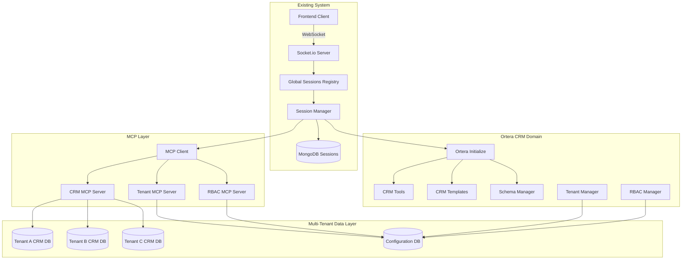
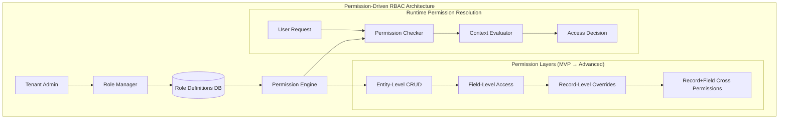
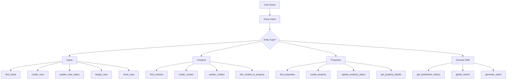
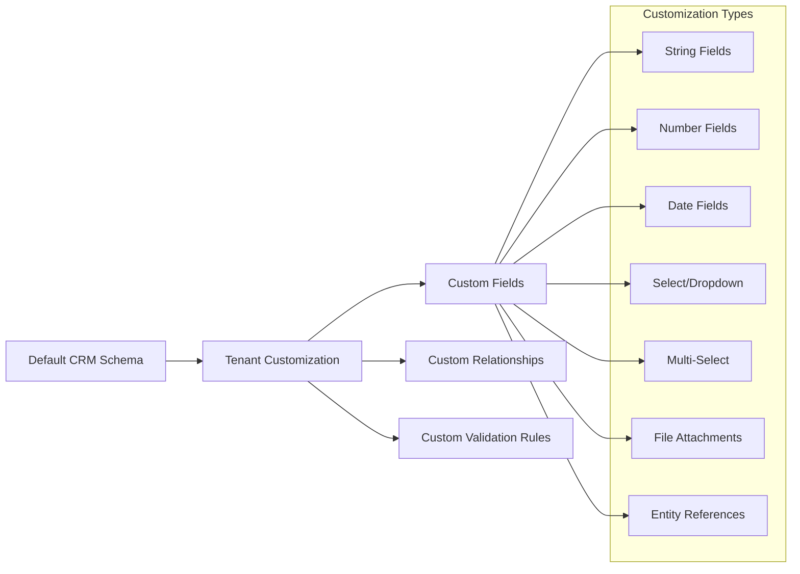
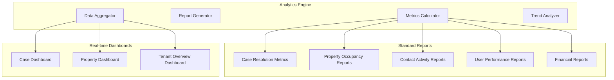
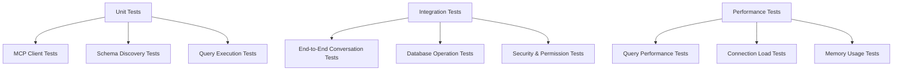

# Ortera & MCP Integration Implementation Plan

## Project Overview

**Ortera** is a comprehensive **AI-powered CRM platform specifically designed for property management companies**. Built as a new domain within the existing session management architecture, Ortera provides multi-tenant property management operations with sophisticated role-based access control (RBAC), industry-specific default schemas (cases, contacts, properties), and an intelligent conversational interface powered by Model Context Protocol (MCP) servers.

**Key Differentiators**:
- **Property Management Focus**: Purpose-built for residential and commercial property management workflows
- **Multi-Tenant SaaS Architecture**: Each property management company operates in complete isolation
- **Industry-Specific Schemas**: Pre-configured entities for cases (maintenance, leasing, complaints), contacts (tenants, owners, vendors), and properties
- **Intelligent Permissions**: Role-based access with property-level, team-level, and company-level permissions
- **Conversational CRM**: Natural language queries like "Find all overdue maintenance cases for Building A" or "Show me prospects interested in 2-bedroom units"

## Goals & Objectives

### Primary Goals
1. **Property Management CRM**: Create a comprehensive CRM system tailored specifically for property management operations (residential & commercial)
2. **Multi-Tenant SaaS Platform**: Support unlimited property management companies with complete data isolation and independent configurations
3. **Industry-Specific RBAC**: Implement property management role hierarchy (Admin, Property Manager, Leasing Agent, Maintenance Coordinator, Tenant Portal User)
4. **Conversational Property Operations**: Natural language interface for complex property queries ("Show maintenance cases for properties managed by John", "Find available 2BR units under $2000")
5. **Customizable Property Schemas**: Industry-standard schemas (Case, Contact, Property, Lease, Work Order) with tenant-specific customizations
6. **Secure MCP Integration**: Leverage MCP for standardized, permission-aware database operations with audit trails

### Technical Objectives
- Implement multi-tenant MongoDB architecture with tenant isolation
- Create RBAC system with role and permission management
- Build MCP servers with tenant-aware and permission-aware operations
- Utilize existing schema templates (case_templates, property_templates, contact_templates) stored in DB
- Maintain compatibility with existing architecture patterns
- Ensure data security and compliance for property management operations

## Architecture Overview



## Property Management Conversational AI Capabilities

### Natural Language Query Examples

**Maintenance Operations**:
- "Show me all urgent maintenance cases for Building A that are overdue"
- "Find HVAC work orders scheduled for this week with costs over $500"
- "Which properties have the most maintenance requests this month?"
- "Create a new emergency maintenance case for unit 2B - water leak in kitchen"

**Leasing & Tenant Management**:
- "List all 2-bedroom units available next month under $2000"
- "Show prospects who viewed properties last week but haven't applied"
- "Which leases are expiring in the next 60 days?"
- "Find tenants with overdue rent payments for more than 30 days"

**Property Analytics**:
- "What's the average vacancy rate across all properties?"
- "Show revenue trends for the downtown portfolio this year"
- "Which vendors have the highest service costs?"
- "Generate a rent roll report for Sunset Apartments"

**Multi-Tenant Context Aware**:
- "Show me maintenance cases I'm assigned to" (respects RBAC permissions)
- "List properties I manage" (filtered by user's property assignments)
- "Find all cases for my team this week" (team-scoped queries)

### AI-Powered Insights

```mermaid
graph TB
    subgraph "Conversational AI Layer"
        NLProcessor[Natural Language Processor]
        IntentClassifier[Intent Classifier]
        EntityExtractor[Entity Extractor]
        ContextResolver[Context Resolver]
        QueryBuilder[Query Builder]
        ResponseFormatter[Response Formatter]
    end
    
    subgraph "Property Management Intents"
        FindIntent[Find/Search Records]
        CreateIntent[Create New Records]
        UpdateIntent[Update Existing Records]
        AnalyzeIntent[Analytics & Reports]
        AssignIntent[Assign Tasks/Cases]
        ScheduleIntent[Schedule Activities]
    end
    
    subgraph "Entity Recognition"
        PropertyEntities[Properties, Units, Buildings]
        PersonEntities[Tenants, Vendors, Staff]
        FinancialEntities[Rent, Costs, Revenue]
        TimeEntities[Dates, Ranges, Schedules]
        StatusEntities[Priorities, States, Categories]
    end
    
    NLProcessor --> IntentClassifier
    NLProcessor --> EntityExtractor
    IntentClassifier --> FindIntent
    IntentClassifier --> CreateIntent
    IntentClassifier --> UpdateIntent
    IntentClassifier --> AnalyzeIntent
    IntentClassifier --> AssignIntent
    IntentClassifier --> ScheduleIntent
    
    EntityExtractor --> PropertyEntities
    EntityExtractor --> PersonEntities
    EntityExtractor --> FinancialEntities
    EntityExtractor --> TimeEntities
    EntityExtractor --> StatusEntities
    
    ContextResolver --> QueryBuilder
    QueryBuilder --> ResponseFormatter
```



### Permission-Aware Responses

The conversational AI automatically applies user permissions and tenant context:

```typescript
interface ConversationalContext {
  user: {
    permissions: Permission[];
    tenantId: string;
    managedProperties: ObjectId[];
    teamMembers: ObjectId[];
  };
  query: {
    intent: string;
    entities: ExtractedEntity[];
    filters: QueryFilter[];
  };
  response: {
    data: any[];
    permissionFiltered: boolean;
    suggestedActions: string[];
  };
}

// Example: "Show me all maintenance cases"
// - Admin sees all cases across all properties
// - Property Manager sees cases for their assigned properties only
// - Maintenance Coordinator sees all maintenance cases but not leasing cases
// - Tenant sees only their own submitted cases
```

## Implementation Phases

### Phase 1: Core Infrastructure & Entity-Level Permissions (Week 1-2)

**Focus**: Multi-tenant foundation + MVP permission system (Entity-Level CRUD only)

#### 1.1 Multi-Tenant Database Architecture
**File**: `src/infrastructure/mongodb/tenant-manager.ts`

```typescript
interface TenantConfiguration {
  tenantId: string;
  name: string;
  domain: string;
  databaseName: string;
  customSchemas: Record<string, SchemaDefinition>;
  settings: TenantSettings;
  createdAt: Date;
  updatedAt: Date;
}

interface TenantSettings {
  maxUsers: number;
  maxRecords: number;
  enabledFeatures: string[];
  customFields: Record<string, CustomFieldDefinition>;
}
```

**Key Features**:
- Tenant isolation with separate MongoDB databases
- Tenant-specific schema customizations
- Resource limits and feature flags per tenant
- Automatic tenant database provisioning

#### 1.2 Permission-Driven Access Control Architecture
**File**: `src/infrastructure/rbac/rbac-manager.ts`

**Key Design Principles**:
1. **Dynamic, Configurable Roles**: Roles are stored in database, not hardcoded
2. **Permission-First Design**: Roles are simply named collections of permissions
3. **Granular Control**: Support for entity-level, field-level, and record-level permissions
4. **Incremental Implementation**: MVP → Field-Level → Record-Level → Record+Field-Level
5. **Future-Proof**: Tenant administrators can create custom roles



### MVP Implementation: Entity-Level Permissions

**Core Permission Structure**:
```typescript
interface BasePermission {
  id: string;
  tenantId: string;
  resource: string;           // 'case', 'contact', 'property', 'lease', etc.
  action: string;            // 'create', 'read', 'update', 'delete', 'assign', etc.
  scope: string;             // 'own', 'team', 'property', 'building', 'all'
  conditions?: PermissionCondition[];
  metadata: {
    description: string;
    createdAt: Date;
    updatedAt: Date;
  };
}

interface PermissionCondition {
  field: string;             // Field to check (e.g., 'status', 'priority', 'assignedTo')
  operator: 'equals' | 'in' | 'not_equals' | 'not_in' | 'greater_than' | 'less_than';
  value: any;               // Value to compare against
  logicalOperator?: 'AND' | 'OR';  // For chaining conditions
}

interface Role {
  id: string;
  tenantId: string;
  name: string;
  description: string;
  permissions: string[];     // Array of permission IDs
  isSystemRole: boolean;     // false = tenant can modify, true = system-defined
  metadata: {
    createdAt: Date;
    updatedAt: Date;
    createdBy: string;
  };
}

interface UserRoleAssignment {
  userId: string;
  roleId: string;
  tenantId: string;
  scope?: {                 // Optional: limit role to specific properties/teams
    propertyIds?: string[];
    teamIds?: string[];
    buildingIds?: string[];
  };
  expiresAt?: Date;
  assignedAt: Date;
  assignedBy: string;
}
```

**Default Property Management Permission Templates**:
```typescript
const PROPERTY_MANAGEMENT_PERMISSION_TEMPLATES = {
  // Entity-Level Permissions (MVP)
  permissions: [
    // Case Management Permissions
    { id: 'case:create:all', resource: 'case', action: 'create', scope: 'all' },
    { id: 'case:read:all', resource: 'case', action: 'read', scope: 'all' },
    { id: 'case:read:property', resource: 'case', action: 'read', scope: 'property' },
    { id: 'case:read:own', resource: 'case', action: 'read', scope: 'own' },
    { id: 'case:update:all', resource: 'case', action: 'update', scope: 'all' },
    { id: 'case:update:property', resource: 'case', action: 'update', scope: 'property' },
    { id: 'case:assign:all', resource: 'case', action: 'assign', scope: 'all' },
    { id: 'case:close:all', resource: 'case', action: 'close', scope: 'all' },
    
    // Contact Management Permissions
    { id: 'contact:create:all', resource: 'contact', action: 'create', scope: 'all' },
    { id: 'contact:read:all', resource: 'contact', action: 'read', scope: 'all' },
    { id: 'contact:read:property', resource: 'contact', action: 'read', scope: 'property' },
    { id: 'contact:update:property', resource: 'contact', action: 'update', scope: 'property' },
    
    // Property Management Permissions
    { id: 'property:read:all', resource: 'property', action: 'read', scope: 'all' },
    { id: 'property:read:assigned', resource: 'property', action: 'read', scope: 'property' },
    { id: 'property:update:assigned', resource: 'property', action: 'update', scope: 'property' },
    
    // Financial Permissions
    { id: 'financial:read:property', resource: 'financial', action: 'read', scope: 'property' },
    { id: 'financial:read:all', resource: 'financial', action: 'read', scope: 'all' },
    
    // System Permissions
    { id: 'user:read:all', resource: 'user', action: 'read', scope: 'all' },
    { id: 'role:manage:all', resource: 'role', action: '*', scope: 'all' }
  ],
  
  // Default Role Templates (configurable starting points)
  roleTemplates: [
    {
      id: 'company_administrator',
      name: 'Company Administrator',
      description: 'Full access to all company data and settings',
      permissions: ['*:*:all'],  // Wildcard permission
      isSystemRole: true
    },
    {
      id: 'property_manager_template',
      name: 'Property Manager',
      description: 'Manages assigned properties and related operations',
      permissions: [
        'case:*:property', 'contact:*:property', 'property:*:property',
        'lease:*:property', 'work_order:*:property', 'financial:read:property'
      ],
      isSystemRole: false  // Tenants can customize this role
    },
    {
      id: 'leasing_agent_template',
      name: 'Leasing Agent',
      description: 'Handles prospective tenants and lease applications',
      permissions: [
        'contact:*:team', 'property:read:all', 'lease:create:team',
        'case:create:own', 'case:read:own'
      ],
      isSystemRole: false
    },
    {
      id: 'maintenance_coordinator_template',
      name: 'Maintenance Coordinator',
      description: 'Manages work orders and vendor relationships',
      permissions: [
        'work_order:*:all', 'case:*:all', 'contact:*:all',
        'property:read:all', 'vendor:*:all'
      ],
      isSystemRole: false
    },
    {
      id: 'tenant_portal_template',
      name: 'Tenant Portal User',
      description: 'Limited self-service access for tenants',
      permissions: [
        'case:create:own', 'case:read:own', 'contact:read:own',
        'lease:read:own', 'payment:read:own'
      ],
      isSystemRole: true  // Tenants cannot modify this security-critical role
    }
  ]
};
```

### Permission Engine Implementation

```typescript
class PermissionEngine {
  /**
   * MVP: Entity-level permission checking
   * Future: Will be extended for field-level and record-level
   */
  async checkPermission(
    userId: string,
    tenantId: string,
    resource: string,
    action: string,
    context?: PermissionContext
  ): Promise<boolean> {
    // 1. Get user's effective permissions (from all assigned roles)
    const userPermissions = await this.getUserEffectivePermissions(userId, tenantId);
    
    // 2. Find matching permissions for this resource+action
    const applicablePermissions = userPermissions.filter(p => 
      this.matchesResourceAction(p, resource, action)
    );
    
    // 3. Evaluate scope and conditions
    for (const permission of applicablePermissions) {
      if (await this.evaluatePermissionScope(permission, context)) {
        return true;
      }
    }
    
    return false;
  }

  /**
   * Future Enhancement: Field-level permission checking
   */
  async checkFieldPermission(
    userId: string,
    tenantId: string,
    resource: string,
    action: string,
    fieldName: string,
    context?: PermissionContext
  ): Promise<boolean> {
    // To be implemented in Phase 2
    // Will check both entity-level AND field-level permissions
    return this.checkPermission(userId, tenantId, resource, action, context);
  }

  /**
   * Future Enhancement: Record-level permission checking
   */
  async checkRecordPermission(
    userId: string,
    tenantId: string,
    resource: string,
    action: string,
    recordId: string,
    context?: PermissionContext
  ): Promise<boolean> {
    // To be implemented in Phase 3
    // Will check entity-level, then apply record-level overrides
    return this.checkPermission(userId, tenantId, resource, action, context);
  }
}

interface PermissionContext {
  propertyIds?: string[];
  teamIds?: string[];
  buildingIds?: string[];
  recordData?: Record<string, any>;  // For record-level permissions
  requestingUserId?: string;
}
```

### Incremental Implementation Roadmap

**Phase 1 (MVP): Entity-Level Permissions**
- ✅ Basic CRUD permissions per resource type
- ✅ Scope-based access (own, team, property, all)
- ✅ Configurable roles stored in database
- ✅ Permission templates for common property management roles
- ✅ Wildcard permissions for admin roles

**Phase 2: Field-Level Permissions**
- 🔄 Granular field access control
- 🔄 Sensitive field protection (SSN, bank details)
- 🔄 Read-only vs read-write field permissions
- 🔄 Custom field permission inheritance

**Phase 3: Record-Level Permissions**
- 🔄 Property-specific access overrides
- 🔄 Owner-based record access
- 🔄 Tenant-specific data isolation
- 🔄 Time-based access (lease periods)

**Phase 4: Advanced Cross-Permissions**
- 🔄 Record+Field combined permissions
- 🔄 Conditional access based on record state
- 🔄 Dynamic permission calculation
- 🔄 Permission inheritance hierarchies

### Role Management Interface (Future)

```typescript
interface TenantRoleManager {
  // Tenant administrators can create/modify non-system roles
  createCustomRole(tenantId: string, roleDefinition: Partial<Role>): Promise<Role>;
  modifyRole(tenantId: string, roleId: string, changes: Partial<Role>): Promise<Role>;
  assignRoleToUser(tenantId: string, userId: string, roleId: string, scope?: RoleScope): Promise<void>;
  
  // Permission discovery and validation
  getAvailablePermissions(tenantId: string): Promise<BasePermission[]>;
  validatePermissionSet(tenantId: string, permissionIds: string[]): Promise<ValidationResult>;
  previewRoleAccess(tenantId: string, roleId: string): Promise<AccessPreview>;
}
      { resource: 'work_order', action: '*', scope: 'all' },
      { resource: 'case', action: '*', scope: 'all', conditions: [{ field: 'category', value: 'maintenance' }] },
      { resource: 'contact', action: '*', scope: 'all', conditions: [{ field: 'type', value: 'vendor' }] },
      { resource: 'property', action: 'read', scope: 'all' }
    ]
  },
  tenant_portal: {
    name: "Tenant Portal User",
    description: "Limited access for tenant self-service",
    permissions: [
      { resource: 'case', action: 'create', scope: 'own', conditions: [{ field: 'category', in: ['maintenance', 'complaint'] }] },
      { resource: 'case', action: 'read', scope: 'own' },
      { resource: 'contact', action: 'read', scope: 'own' },
      { resource: 'lease', action: 'read', scope: 'own' }
    ]
  }
};
```

#### 1.3 Property Management CRM Schema System
**File**: `src/ortera/schemas/crm-schemas.ts`

```typescript
// Property Management Case Schema
interface PropertyCaseSchema {
  _id: ObjectId;
  tenantId: string;
  caseNumber: string;        // Auto-generated: "MNT-2024-001"
  title: string;
  description: string;
  status: 'open' | 'assigned' | 'in_progress' | 'pending_approval' | 'resolved' | 'closed';
  priority: 'low' | 'medium' | 'high' | 'urgent';
  
  // Property Management Specific Categories
  category: 'maintenance' | 'leasing' | 'complaint' | 'inspection' | 'violation' | 'emergency';
  subcategory?: string;      // HVAC, Plumbing, Electrical, Appliance, etc.
  
  // Location & Property Context
  propertyId: ObjectId;      // Required - every case must be property-related
  unitNumber?: string;       // Specific unit if applicable
  buildingId?: ObjectId;     // For multi-building properties
  
  // People & Assignment
  contactId?: ObjectId;      // Reporter (tenant, owner, etc.)
  assignedToId?: ObjectId;   // Staff member assigned
  vendorId?: ObjectId;       // External vendor if applicable
  
  // Financial & Work Order Integration
  estimatedCost?: number;
  actualCost?: number;
  workOrderNumber?: string;
  invoiceNumber?: string;
  
  // Dates & SLA Tracking
  createdAt: Date;
  updatedAt: Date;
  dueDate?: Date;
  scheduledDate?: Date;
  completedAt?: Date;
  slaBreached?: boolean;
  
  // Documentation & Communication
  attachments: PropertyAttachment[];
  notes: CaseNote[];
  communications: CaseCommunication[];
  
  // Compliance & Tracking
  requiresPermit?: boolean;
  safetyIssue?: boolean;
  tenantNotified?: boolean;
  followUpRequired?: boolean;
  
  customFields: Record<string, any>;
}

// Enhanced Contact Schema for Property Management
interface PropertyContactSchema {
  _id: ObjectId;
  tenantId: string;
  contactNumber: string;     // Auto-generated: "CNT-2024-001"
  
  // Contact Type & Status
  type: 'current_tenant' | 'prospect' | 'owner' | 'vendor' | 'emergency_contact' | 'guarantor' | 'property_manager';
  status: 'active' | 'inactive' | 'prospect' | 'former_tenant' | 'blacklisted';
  
  // Personal Information
  firstName: string;
  lastName: string;
  companyName?: string;      // For vendors/companies
  email?: string;
  phone?: string;
  alternatePhone?: string;
  preferredContactMethod: 'email' | 'phone' | 'text' | 'portal';
  
  // Address & Location
  mailingAddress?: Address;
  emergencyContactInfo?: EmergencyContact[];
  
  // Property Relationships
  primaryPropertyId?: ObjectId;    // Main property association
  propertyIds: ObjectId[];         // All associated properties
  unitNumbers: string[];           // Specific units
  
  // Tenant-Specific Data
  leaseInformation?: {
    currentLeaseId?: ObjectId;
    leaseStart?: Date;
    leaseEnd?: Date;
    monthlyRent?: number;
    securityDeposit?: number;
    petDeposit?: number;
    moveInDate?: Date;
    moveOutDate?: Date;
    renewalOptions?: number;
  };
  
  // Vendor-Specific Data
  vendorInformation?: {
    serviceTypes: string[];        // HVAC, Plumbing, Electrical, etc.
    licenseNumber?: string;
    insuranceExpiry?: Date;
    rating?: number;
    preferredVendor?: boolean;
    emergencyServices?: boolean;
  };
  
  // Financial & Payment
  accountBalance?: number;
  paymentMethod?: string;
  autoPayEnabled?: boolean;
  creditScore?: number;
  backgroundCheckStatus?: string;
  
  // Communication History
  communicationPreferences: {
    maintenanceNotifications: boolean;
    rentReminders: boolean;
    propertyUpdates: boolean;
    marketingEmails: boolean;
  };
  
  // Metadata
  createdAt: Date;
  updatedAt: Date;
  tags: string[];
  notes: ContactNote[];
  documents: ContactDocument[];
  customFields: Record<string, any>;
}

// Comprehensive Property Schema
interface PropertyManagementSchema {
  _id: ObjectId;
  tenantId: string;
  propertyNumber: string;    // "PROP-001" or custom numbering
  
  // Property Identification & Classification
  propertyName?: string;     // "Sunset Apartments Building A"
  address: PropertyAddress;
  propertyType: 'residential' | 'commercial' | 'mixed_use' | 'parking' | 'storage';
  buildingType: 'apartment' | 'single_family' | 'townhouse' | 'duplex' | 'office' | 'retail' | 'warehouse';
  
  // Physical Characteristics
  totalUnits?: number;
  availableUnits?: number;
  bedrooms?: number;
  bathrooms?: number;
  squareFootage?: number;
  lotSize?: number;
  yearBuilt?: number;
  floors?: number;
  parkingSpaces?: number;
  
  // Financial Information
  marketRent?: number;
  currentRent?: number;
  securityDeposit?: number;
  applicationFee?: number;
  petFee?: number;
  lateFee?: number;
  
  // Property Status & Availability
  status: 'available' | 'occupied' | 'maintenance' | 'renovation' | 'off_market' | 'sold';
  availabilityDate?: Date;
  showingInstructions?: string;
  
  // Ownership & Management
  ownerId?: ObjectId;        // Property owner contact
  propertyManagerId?: ObjectId;  // Assigned property manager
  portfolioId?: ObjectId;    // Property portfolio/group
  
  // Current Occupancy
  currentTenantIds: ObjectId[];
  currentLeaseIds: ObjectId[];
  maxOccupancy?: number;
  
  // Property Features & Amenities
  amenities: string[];       // Pool, Gym, Parking, AC, etc.
  appliances: string[];      // Refrigerator, Washer/Dryer, etc.
  utilities: {
    electric?: 'tenant' | 'owner' | 'shared';
    gas?: 'tenant' | 'owner' | 'shared';
    water?: 'tenant' | 'owner' | 'shared';
    internet?: 'tenant' | 'owner' | 'included';
    trash?: 'tenant' | 'owner' | 'included';
  };
  
  // Maintenance & Inspection
  lastInspectionDate?: Date;
  nextInspectionDue?: Date;
  maintenanceSchedule?: MaintenanceSchedule[];
  warrantyInformation?: PropertyWarranty[];
  
  // Marketing & Leasing
  marketingStatus: 'not_marketing' | 'active' | 'pending' | 'leased';
  marketingDescription?: string;
  photos: PropertyPhoto[];
  virtualTourUrl?: string;
  floorPlanUrl?: string;
  
  // Compliance & Legal
  permits: PropertyPermit[];
  certificates: PropertyCertificate[];
  insurancePolicies: InsurancePolicy[];
  
  // Financial Performance
  monthlyRevenue?: number;
  yearlyRevenue?: number;
  expenses: PropertyExpense[];
  
  // Metadata
  createdAt: Date;
  updatedAt: Date;
  lastModifiedBy: ObjectId;
  customFields: Record<string, any>;
}

// Additional Property Management Schemas
interface LeaseAgreementSchema {
  _id: ObjectId;
  tenantId: string;
  leaseNumber: string;
  
  propertyId: ObjectId;
  tenantIds: ObjectId[];     // Primary and additional tenants
  
  // Lease Terms
  leaseType: 'fixed' | 'month_to_month' | 'corporate' | 'student';
  startDate: Date;
  endDate: Date;
  monthlyRent: number;
  securityDeposit: number;
  
  // Renewal & Termination
  renewalOptions?: number;
  renewalNoticeRequired?: number;  // days
  terminationClause?: string;
  
  // Status & Tracking
  status: 'draft' | 'active' | 'expired' | 'terminated' | 'renewed';
  signedDate?: Date;
  
  customFields: Record<string, any>;
}

interface WorkOrderSchema {
  _id: ObjectId;
  tenantId: string;
  workOrderNumber: string;
  
  // Related Entities
  propertyId: ObjectId;
  caseId?: ObjectId;         // Associated case
  vendorId?: ObjectId;       // Assigned vendor
  requestedById?: ObjectId;  // Who requested the work
  
  // Work Details
  category: 'maintenance' | 'repair' | 'improvement' | 'emergency' | 'inspection';
  description: string;
  priority: 'low' | 'medium' | 'high' | 'emergency';
  
  // Scheduling & Status
  status: 'created' | 'assigned' | 'scheduled' | 'in_progress' | 'completed' | 'cancelled';
  scheduledDate?: Date;
  completedDate?: Date;
  
  // Financial
  estimatedCost?: number;
  actualCost?: number;
  
  customFields: Record<string, any>;
}
```
  
  // Metadata
  createdAt: Date;
  updatedAt: Date;
  amenities: string[];
  customFields: Record<string, any>;
}
```

### Phase 2: MCP Integration & Field-Level Permissions (Week 2-3)

**Focus**: MCP server implementation + Field-level permission layer

#### 2.1 CRM MCP Server Architecture
**File**: `src/infrastructure/mcp/crm-mcp-server.ts`

```mermaid
graph TB
    subgraph "CRM MCP Server"
        AuthHandler[Authentication Handler]
        TenantResolver[Tenant Resolver]
        PermissionChecker[Permission Checker]
        ResourceHandler[Resource Handler]
        ToolHandler[Tool Handler]
    end
    
    subgraph "Resources"
        Cases[crm://cases]
        Contacts[crm://contacts]
        Properties[crm://properties]
        Users[crm://users]
        Schema[crm://schema/{entity}]
        Dashboard[crm://dashboard/{metric}]
    end
    
    subgraph "Tools"
        FindRecords[crm_find_records]
        CreateRecord[crm_create_record]
        UpdateRecord[crm_update_record]
        DeleteRecord[crm_delete_record]
        SearchRecords[crm_search_records]
        AssignCase[crm_assign_case]
        UpdateStatus[crm_update_status]
    end
    
    AuthHandler --> TenantResolver
    TenantResolver --> PermissionChecker
    PermissionChecker --> ResourceHandler
    PermissionChecker --> ToolHandler
    
    ResourceHandler --> Cases
    ResourceHandler --> Contacts
    ResourceHandler --> Properties
    ResourceHandler --> Users
    ResourceHandler --> Schema
    ResourceHandler --> Dashboard
    
    ToolHandler --> FindRecords
    ToolHandler --> CreateRecord
    ToolHandler --> UpdateRecord
    ToolHandler --> DeleteRecord
    ToolHandler --> SearchRecords
    ToolHandler --> AssignCase
    ToolHandler --> UpdateStatus
```

#### 2.2 Authentication & Session Context
**File**: `src/ortera/auth/session-context.ts`

```typescript
interface OrteraSessionContext {
  user: {
    id: string;
    email: string;
    tenantId: string;
    roles: string[];
    permissions: Permission[];
  };
  tenant: {
    id: string;
    name: string;
    database: string;
    customSchemas: Record<string, any>;
    settings: TenantSettings;
  };
  session: {
    id: string;
    lastActivity: Date;
    preferences: UserPreferences;
  };
}

class SessionContextManager {
  static async createContext(sessionId: string, userToken: string): Promise<OrteraSessionContext> {
    // Validate user token
    // Load user and tenant information
    // Load user permissions
    // Return enriched context
  }
  
  static async validatePermission(
    context: OrteraSessionContext, 
    resource: string, 
    action: string, 
    targetId?: string
  ): Promise<boolean> {
    // Check if user has permission for this action
    // Consider scope (own, team, all)
    // Apply conditional permissions
  }
}
```

#### 2.2.1 Field-Level Permission Implementation

**Extension of MVP Entity-Level Permissions**:
```typescript
interface FieldPermission extends BasePermission {
  resource: string;                    // 'case', 'contact', 'property', etc.
  action: 'read' | 'write';           // Field-level actions
  fieldPath: string;                  // 'email', 'phone', 'financials.rentAmount', etc.
  conditions?: FieldPermissionCondition[];
}

interface FieldPermissionCondition {
  when: 'record_matches' | 'user_matches' | 'tenant_setting';
  field?: string;                     // Field to check in record
  operator: 'equals' | 'in' | 'user_is_owner';
  value?: any;
}

// Example Field Permissions for Property Management
const FIELD_PERMISSION_EXAMPLES = [
  // Sensitive financial data - only property managers and above
  {
    id: 'contact:read:financial_fields',
    resource: 'contact',
    action: 'read',
    fieldPath: 'financials.*',        // Wildcard for all financial fields
    scope: 'property',
    conditions: [
      { when: 'user_matches', field: 'role', operator: 'in', value: ['property_manager', 'admin'] }
    ]
  },
  
  // Personal tenant information - restricted by relationship
  {
    id: 'contact:read:personal_details',
    resource: 'contact',
    action: 'read',
    fieldPath: 'ssn',
    scope: 'own',
    conditions: [
      { when: 'record_matches', field: 'assignedPropertyManager', operator: 'user_is_owner' }
    ]
  },
  
  // Maintenance cost details - maintenance coordinators can read all
  {
    id: 'case:read:cost_fields',
    resource: 'case',
    action: 'read',
    fieldPath: 'financials.actualCost',
    scope: 'all',
    conditions: [
      { when: 'user_matches', field: 'role', operator: 'in', value: ['maintenance_coordinator', 'property_manager', 'admin'] }
    ]
  },
  
  // Lease terms - leasing agents can write during application process
  {
    id: 'lease:write:terms',
    resource: 'lease',
    action: 'write',
    fieldPath: 'terms.*',
    scope: 'team',
    conditions: [
      { when: 'record_matches', field: 'status', operator: 'in', value: ['draft', 'pending_approval'] }
    ]
  }
];

class FieldPermissionEngine extends PermissionEngine {
  /**
   * Phase 2: Field-level permission checking
   */
  async checkFieldPermission(
    userId: string,
    tenantId: string,
    resource: string,
    action: 'read' | 'write',
    fieldPath: string,
    recordData?: Record<string, any>,
    context?: PermissionContext
  ): Promise<boolean> {
    // 1. First check if user has entity-level permission
    const hasEntityPermission = await super.checkPermission(
      userId, tenantId, resource, action, context
    );
    
    if (!hasEntityPermission) {
      return false;
    }
    
    // 2. Get field-specific permissions
    const fieldPermissions = await this.getUserFieldPermissions(
      userId, tenantId, resource, fieldPath
    );
    
    // 3. Evaluate field-level conditions
    for (const permission of fieldPermissions) {
      if (permission.action === action || permission.action === '*') {
        if (await this.evaluateFieldConditions(permission, recordData, context)) {
          return true;
        }
      }
    }
    
    // 4. If no explicit field permission found, default to entity permission
    // BUT: if field is marked as "sensitive", require explicit permission
    const fieldConfig = await this.getFieldConfiguration(tenantId, resource, fieldPath);
    if (fieldConfig?.sensitive) {
      return false;  // Sensitive fields require explicit permission
    }
    
    return hasEntityPermission;
  }

  /**
   * Filter record data based on field permissions
   */
  async filterRecordFields(
    userId: string,
    tenantId: string,
    resource: string,
    records: Record<string, any>[],
    context?: PermissionContext
  ): Promise<Record<string, any>[]> {
    const filteredRecords = [];
    
    for (const record of records) {
      const filteredRecord: Record<string, any> = {};
      
      for (const [fieldPath, value] of Object.entries(record)) {
        const canRead = await this.checkFieldPermission(
          userId, tenantId, resource, 'read', fieldPath, record, context
        );
        
        if (canRead) {
          filteredRecord[fieldPath] = value;
        } else {
          // Replace sensitive data with placeholder or omit entirely
          filteredRecord[fieldPath] = '[REDACTED]';
        }
      }
      
      filteredRecords.push(filteredRecord);
    }
    
    return filteredRecords;
  }
}
```

**Field-Level Permission Configuration**:
```typescript
interface FieldConfiguration {
  fieldPath: string;
  sensitive: boolean;                 // Requires explicit permission
  piiType?: 'email' | 'phone' | 'ssn' | 'financial';
  defaultPermission?: 'allow' | 'deny';
  auditLog: boolean;                  // Log all access to this field
}

// Property Management Field Configurations
const PROPERTY_MANAGEMENT_FIELD_CONFIG = [
  // Contact sensitive fields
  { fieldPath: 'contact.ssn', sensitive: true, piiType: 'ssn', auditLog: true },
  { fieldPath: 'contact.bankAccount', sensitive: true, piiType: 'financial', auditLog: true },
  { fieldPath: 'contact.creditScore', sensitive: true, piiType: 'financial', auditLog: true },
  { fieldPath: 'contact.backgroundCheck', sensitive: true, auditLog: true },
  
  // Property financial fields
  { fieldPath: 'property.purchasePrice', sensitive: true, piiType: 'financial' },
  { fieldPath: 'property.mortgageDetails', sensitive: true, piiType: 'financial' },
  { fieldPath: 'property.profitMargin', sensitive: true, piiType: 'financial' },
  
  // Case cost information
  { fieldPath: 'case.actualCost', sensitive: false, defaultPermission: 'allow' },
  { fieldPath: 'case.vendorPricing', sensitive: true, piiType: 'financial' },
  
  // Maintenance sensitive data
  { fieldPath: 'workOrder.vendorQuotes', sensitive: true, piiType: 'financial' },
  { fieldPath: 'workOrder.emergencyAccess', sensitive: true, auditLog: true }
];
```

#### 2.3 Tenant-Aware MCP Operations
**File**: `src/ortera/mcp/tenant-aware-operations.ts`

```typescript
interface TenantAwareOperation {
  tenantId: string;
  userId: string;
  operation: string;
  resource: string;
  filters: Record<string, any>;
  permissions: Permission[];
}

class TenantAwareCRMOperations {
  async findRecords(operation: TenantAwareOperation): Promise<any[]> {
    // 1. Validate permissions
    await this.validatePermission(operation);
    
    // 2. Apply tenant isolation
    const tenantFilters = { tenantId: operation.tenantId };
    
    // 3. Apply permission-based filters
    const scopedFilters = this.applyScopeFilters(operation);
    
    // 4. Execute query with combined filters
    const query = { ...tenantFilters, ...scopedFilters, ...operation.filters };
    return await this.executeQuery(operation.resource, query);
  }
  
  private applyScopeFilters(operation: TenantAwareOperation): Record<string, any> {
    const permission = this.findPermission(operation);
    
    switch (permission.scope) {
      case 'own':
        return { createdBy: operation.userId };
      case 'team':
        return { assignedToTeam: { $in: await this.getUserTeams(operation.userId) } };
      case 'all':
        return {};
      default:
        throw new Error('Invalid permission scope');
    }
  }
}
```

### Phase 3: Ortera Domain & Record-Level Permissions (Week 3-4)

**Focus**: Property management domain + Record-level permission overrides

#### 3.0 Record-Level Permission Implementation

**Building on Entity-Level and Field-Level Permissions**:
```typescript
interface RecordPermission extends BasePermission {
  resource: string;                    // 'case', 'contact', 'property', etc.
  action: string;                     // 'read', 'write', 'delete', etc.
  recordConditions: RecordCondition[];  // Conditions that must be met on the specific record
  overrideType: 'allow' | 'deny';     // Whether this overrides base permissions
  priority: number;                   // Higher priority overrides lower priority
}

interface RecordCondition {
  field: string;                      // Field in the record to check
  operator: 'equals' | 'in' | 'contains' | 'user_is' | 'property_managed_by' | 'tenant_of';
  value?: any;
  userContext?: 'userId' | 'teamId' | 'managedProperties' | 'assignedProperties';
}

// Property Management Record-Level Permission Examples
const RECORD_PERMISSION_EXAMPLES = [
  // Property managers can access all records for their assigned properties
  {
    id: 'case:full_access:assigned_properties',
    resource: 'case',
    action: '*',
    recordConditions: [
      { field: 'propertyId', operator: 'property_managed_by', userContext: 'userId' }
    ],
    overrideType: 'allow',
    priority: 100
  },
  
  // Leasing agents can only access cases they created or were assigned
  {
    id: 'case:limited_access:own_or_assigned',
    resource: 'case',
    action: 'read',
    recordConditions: [
      { field: 'createdBy', operator: 'user_is', userContext: 'userId' },
      { field: 'assignedTo', operator: 'user_is', userContext: 'userId' }
    ],
    overrideType: 'allow',
    priority: 50
  },
  
  // Tenants can only see their own contact information
  {
    id: 'contact:tenant_self_access',
    resource: 'contact',
    action: 'read',
    recordConditions: [
      { field: '_id', operator: 'user_is', userContext: 'userId' },
      { field: 'type', operator: 'equals', value: 'tenant' }
    ],
    overrideType: 'allow',
    priority: 200
  },
  
  // Financial data restricted to senior roles for high-value properties
  {
    id: 'property:financial_restriction:high_value',
    resource: 'property',
    action: 'read',
    recordConditions: [
      { field: 'marketValue', operator: 'greater_than', value: 1000000 },
      { field: 'userRole', operator: 'in', value: ['senior_manager', 'admin'] }
    ],
    overrideType: 'deny',
    priority: 150
  },
  
  // Maintenance cases - emergency cases can be viewed by all maintenance staff
  {
    id: 'case:emergency_access:maintenance_staff',
    resource: 'case',
    action: 'read',
    recordConditions: [
      { field: 'category', operator: 'equals', value: 'emergency' },
      { field: 'userRole', operator: 'contains', value: 'maintenance' }
    ],
    overrideType: 'allow',
    priority: 125
  }
];

class RecordPermissionEngine extends FieldPermissionEngine {
  /**
   * Phase 3: Record-level permission checking
   * Checks Entity → Field → Record permissions in order
   */
  async checkRecordPermission(
    userId: string,
    tenantId: string,
    resource: string,
    action: string,
    recordId: string,
    recordData?: Record<string, any>,
    context?: PermissionContext
  ): Promise<boolean> {
    // 1. First check entity-level permission (base requirement)
    const hasEntityPermission = await super.checkPermission(
      userId, tenantId, resource, action, context
    );
    
    // 2. If no entity permission, check if record-level allows override
    if (!hasEntityPermission) {
      const recordOverrides = await this.getRecordPermissionOverrides(
        userId, tenantId, resource, action, 'allow'
      );
      
      for (const override of recordOverrides) {
        if (await this.evaluateRecordConditions(override, recordData, context)) {
          return true;
        }
      }
      return false;
    }
    
    // 3. Check if record-level denies access (even with entity permission)
    const recordDenials = await this.getRecordPermissionOverrides(
      userId, tenantId, resource, action, 'deny'
    );
    
    for (const denial of recordDenials) {
      if (await this.evaluateRecordConditions(denial, recordData, context)) {
        return false;
      }
    }
    
    // 4. Entity permission granted and no record-level denials
    return true;
  }

  /**
   * Evaluate complex record conditions
   */
  private async evaluateRecordConditions(
    permission: RecordPermission,
    recordData: Record<string, any>,
    context: PermissionContext
  ): Promise<boolean> {
    for (const condition of permission.recordConditions) {
      const conditionMet = await this.evaluateRecordCondition(condition, recordData, context);
      if (!conditionMet) {
        return false;  // All conditions must be met
      }
    }
    return true;
  }

  private async evaluateRecordCondition(
    condition: RecordCondition,
    recordData: Record<string, any>,
    context: PermissionContext
  ): Promise<boolean> {
    const recordValue = recordData[condition.field];
    
    switch (condition.operator) {
      case 'equals':
        return recordValue === condition.value;
      
      case 'in':
        return Array.isArray(condition.value) && condition.value.includes(recordValue);
      
      case 'user_is':
        return recordValue === context.requestingUserId;
      
      case 'property_managed_by':
        // Check if user manages the property referenced in the record
        const propertyId = recordData.propertyId;
        const userManagedProperties = await this.getUserManagedProperties(context.requestingUserId);
        return userManagedProperties.includes(propertyId);
      
      case 'tenant_of':
        // Check if user is a tenant of the property
        const tenantProperties = await this.getUserTenantProperties(context.requestingUserId);
        return tenantProperties.includes(recordValue);
      
      case 'greater_than':
        return Number(recordValue) > Number(condition.value);
      
      default:
        return false;
    }
  }

  /**
   * Apply record-level filtering to query results
   */
  async filterRecordsByPermissions(
    userId: string,
    tenantId: string,
    resource: string,
    action: string,
    records: Record<string, any>[],
    context?: PermissionContext
  ): Promise<Record<string, any>[]> {
    const filteredRecords = [];
    
    for (const record of records) {
      const hasAccess = await this.checkRecordPermission(
        userId, tenantId, resource, action, record._id, record, context
      );
      
      if (hasAccess) {
        // Also apply field-level filtering
        const fieldFilteredRecord = await this.filterRecordFields(
          userId, tenantId, resource, [record], context
        );
        filteredRecords.push(fieldFilteredRecord[0]);
      }
    }
    
    return filteredRecords;
  }
}
```

**Property Management Record-Level Use Cases**:
```typescript
// Example: Property Manager viewing maintenance cases
// - Entity permission: Can view all cases (from role)
// - Record permission: Only cases for properties they manage
// - Field permission: Can see cost details, but not vendor quotes

// Example: Tenant Portal User
// - Entity permission: Cannot view cases (no base permission)
// - Record permission: CAN view cases they created (override allows)
// - Field permission: Cannot see financial details even in their own cases

// Example: Leasing Agent viewing contact information
// - Entity permission: Can view contacts
// - Record permission: Only prospects and tenants for their properties
// - Field permission: Cannot see credit scores or bank information

// Example: Emergency Maintenance Access
// - Entity permission: Limited to own cases
// - Record permission: Emergency cases accessible to all maintenance staff (override)
// - Field permission: Emergency contact details visible to all maintenance
```

#### 3.1 Ortera Initialize
**File**: `src/ortera/initialize.ts`

```typescript
export const orteraSessionInitializer: SessionInitializerFunction = (initialSessionConfig) => {
  return {
    humanHelpMessage: "I'm your AI assistant for managing your property portfolio. I can help you find cases, update contact information, manage properties, and more...",
    initialForm: getCRMAuthenticationForm(),
    initialSessionData: createOrteraSessionData(),
    templateConstants: {
      ...initialSessionConfig,
      crmEntities: ['cases', 'contacts', 'properties'],
      userRoles: [], // Populated after authentication
      tenantSettings: {}, // Populated after tenant resolution
      recentActivity: [],
      quickActions: loadQuickActions()
    },
    rawTemplates: loadOrteraTemplates(),
    toolHandlers: orteraCRMToolHandlers,
    mcpServers: {
      crm: {
        url: "internal://crm-mcp-server",
        type: "internal",
        config: {
          requireAuth: true,
          enableAuditLog: true
        }
      },
      tenant: {
        url: "internal://tenant-mcp-server", 
        type: "internal"
      }
    }
  };
};
```

#### 3.2 CRM Tool Configuration
**File**: `src/ortera/config/tools.ts`



**Key CRM Tools**:

```typescript
export const orteraCRMToolHandlers = {
  // Authentication & Setup
  authenticate_user: {
    tool: {
      type: "function",
      function: {
        name: "authenticate_user",
        description: "Authenticate user and establish CRM session context",
        parameters: {
          type: "object",
          properties: {
            email: { type: "string" },
            password: { type: "string" },
            tenantDomain: { type: "string" }
          },
          required: ["email", "password", "tenantDomain"]
        }
      }
    },
    actions: [
      { name: "call_mcp_tool", server: "crm", tool: "authenticate_user" },
      { name: "establish_session_context" },
      { name: "load_user_preferences" }
    ]
  },

  // Case Management
  find_cases: {
    tool: {
      type: "function", 
      function: {
        name: "find_cases",
        description: "Search for cases based on criteria",
        parameters: {
          type: "object",
          properties: {
            status: { type: "string", enum: ["open", "in_progress", "resolved", "closed"] },
            priority: { type: "string", enum: ["low", "medium", "high", "urgent"] },
            assignedTo: { type: "string" },
            propertyId: { type: "string" },
            createdAfter: { type: "string" },
            limit: { type: "number", default: 10 }
          }
        }
      }
    },
    actions: [
      { name: "call_mcp_tool", server: "crm", tool: "find_records", args: { entity: "cases", filters: "{{args}}" } },
      { name: "format_case_results" },
      { name: "append_thread_item", threadItem: {
          metaRole: "assistant",
          template: { role: "assistant", content: "{{caseResultsTemplate}}" }
        }
      }
    ]
  },

  create_case: {
    tool: {
      type: "function",
      function: {
        name: "create_case", 
        description: "Create a new case",
        parameters: {
          type: "object",
          properties: {
            title: { type: "string" },
            description: { type: "string" },
            priority: { type: "string", enum: ["low", "medium", "high", "urgent"] },
            category: { type: "string" },
            propertyId: { type: "string" },
            contactId: { type: "string" },
            dueDate: { type: "string" }
          },
          required: ["title", "description", "priority", "category"]
        }
      }
    },
    actions: [
      { name: "validate_case_data" },
      { name: "call_mcp_tool", server: "crm", tool: "create_record", args: { entity: "cases", data: "{{args}}" } },
      { name: "send_case_notification" },
      { name: "append_thread_item", threadItem: {
          metaRole: "assistant",
          template: { role: "assistant", content: "{{caseCreatedTemplate}}" },
          buttons: [
            { text: "View Case", action: "view_case", args: { caseId: "{{result.caseId}}" } },
            { text: "Assign Case", action: "assign_case", args: { caseId: "{{result.caseId}}" } }
          ]
        }
      }
    ]
  },

  // Contact Management
  find_contacts: {
    tool: {
      type: "function",
      function: {
        name: "find_contacts",
        description: "Search for contacts",
        parameters: {
          type: "object", 
          properties: {
            name: { type: "string" },
            email: { type: "string" },
            phone: { type: "string" },
            type: { type: "string", enum: ["tenant", "owner", "vendor", "prospect"] },
            propertyId: { type: "string" },
            limit: { type: "number", default: 10 }
          }
        }
      }
    },
    actions: [
      { name: "call_mcp_tool", server: "crm", tool: "find_records", args: { entity: "contacts", filters: "{{args}}" } },
      { name: "format_contact_results" }
    ]
  },

  // Property Management
  find_properties: {
    tool: {
      type: "function",
      function: {
        name: "find_properties", 
        description: "Search for properties",
        parameters: {
          type: "object",
          properties: {
            address: { type: "string" },
            status: { type: "string", enum: ["available", "occupied", "maintenance", "unavailable"] },
            type: { type: "string", enum: ["apartment", "house", "commercial", "parking"] },
            bedrooms: { type: "number" },
            rentRange: { type: "object", properties: { min: { type: "number" }, max: { type: "number" } } },
            limit: { type: "number", default: 10 }
          }
        }
      }
    },
    actions: [
      { name: "call_mcp_tool", server: "crm", tool: "find_records", args: { entity: "properties", filters: "{{args}}" } },
      { name: "format_property_results" }
    ]
  },

  // Dashboard & Analytics
  get_dashboard_metrics: {
    tool: {
      type: "function",
      function: {
        name: "get_dashboard_metrics",
        description: "Get dashboard metrics and KPIs",
        parameters: {
          type: "object",
          properties: {
            timeframe: { type: "string", enum: ["today", "week", "month", "quarter"], default: "week" },
            metrics: { type: "array", items: { type: "string" } }
          }
        }
      }
    },
    actions: [
      { name: "call_mcp_resource", server: "crm", resource: "crm://dashboard/{{args.timeframe}}" },
      { name: "format_dashboard_data" }
    ]
  }
};
```

#### 3.3 CRM Template System
**File**: `src/ortera/templates/`

```
case-results.njk          # Format case search results
contact-results.njk       # Format contact search results  
property-results.njk      # Format property search results
case-created.njk          # Case creation confirmation
dashboard-metrics.njk     # Dashboard and KPI display
error-permission.njk      # Permission denied messages
audit-log.njk            # Activity and audit trail
```

### Phase 4: Advanced Cross-Permissions & Customization (Week 4-5)

**Focus**: Record+Field-level cross permissions + Schema customization

#### 4.0 Record+Field Cross-Permission Implementation

**The Most Advanced Permission Layer**:
```typescript
interface CrossPermission extends BasePermission {
  resource: string;
  action: string;
  fieldPath?: string;                     // Optional: specific field
  recordConditions: RecordCondition[];    // Conditions on the record
  fieldConditions?: FieldCondition[];    // Additional conditions on field content
  crossReferenceChecks?: CrossReferenceCheck[];  // Conditions on related records
  dynamicScope?: DynamicScopeRule[];     // Context-dependent scope calculation
}

interface CrossReferenceCheck {
  relationField: string;                  // Field that references another record
  relatedResource: string;               // The referenced resource type
  relatedConditions: RecordCondition[];  // Conditions on the related record
}

interface DynamicScopeRule {
  condition: string;                     // JavaScript-like condition
  scopeOverride: string;                 // New scope if condition is met
}

// Advanced Property Management Cross-Permission Examples
const CROSS_PERMISSION_EXAMPLES = [
  // Property managers can see tenant financial data only for properties they manage
  // AND only if the tenant has overdue payments
  {
    id: 'contact:financial_data:managed_property_overdue',
    resource: 'contact',
    action: 'read',
    fieldPath: 'financials.*',
    recordConditions: [
      { field: 'type', operator: 'equals', value: 'tenant' },
      { field: 'propertyId', operator: 'property_managed_by', userContext: 'userId' }
    ],
    fieldConditions: [
      { field: 'financials.overdueDays', operator: 'greater_than', value: 0 }
    ],
    crossReferenceChecks: [
      {
        relationField: 'propertyId',
        relatedResource: 'property',
        relatedConditions: [
          { field: 'status', operator: 'not_equals', value: 'sold' }
        ]
      }
    ]
  },
  
  // Maintenance coordinators can see emergency contact info for urgent cases
  // only during business hours OR if case is emergency priority
  {
    id: 'case:emergency_contacts:conditional_access',
    resource: 'case',
    action: 'read',
    fieldPath: 'emergencyContacts.*',
    recordConditions: [
      { field: 'category', operator: 'equals', value: 'maintenance' }
    ],
    dynamicScope: [
      {
        condition: 'priority === "emergency" || (currentHour >= 9 && currentHour <= 17)',
        scopeOverride: 'all'
      }
    ]
  },
  
  // Leasing agents can update property availability status
  // only if they have active prospects AND property is currently available
  {
    id: 'property:update_availability:active_prospects',
    resource: 'property',
    action: 'update',
    fieldPath: 'status',
    recordConditions: [
      { field: 'status', operator: 'equals', value: 'available' }
    ],
    crossReferenceChecks: [
      {
        relationField: '_id',
        relatedResource: 'contact',
        relatedConditions: [
          { field: 'type', operator: 'equals', value: 'prospect' },
          { field: 'assignedAgent', operator: 'equals', userContext: 'userId' },
          { field: 'interestedProperties', operator: 'contains', value: 'this.record._id' }
        ]
      }
    ]
  },
  
  // Financial data access based on property value tier and user seniority
  {
    id: 'property:tiered_financial_access',
    resource: 'property',
    action: 'read',
    fieldPath: 'financials.*',
    dynamicScope: [
      {
        condition: 'record.marketValue < 500000 && user.experience >= 1',
        scopeOverride: 'property'
      },
      {
        condition: 'record.marketValue < 1000000 && user.experience >= 3',
        scopeOverride: 'property'
      },
      {
        condition: 'record.marketValue >= 1000000 && user.seniority === "senior"',
        scopeOverride: 'property'
      }
    ]
  }
];

class CrossPermissionEngine extends RecordPermissionEngine {
  /**
   * Phase 4: Advanced cross-permission checking
   * Combines Entity → Field → Record → Cross-Reference → Dynamic permissions
   */
  async checkCrossPermission(
    userId: string,
    tenantId: string,
    resource: string,
    action: string,
    fieldPath?: string,
    recordId?: string,
    recordData?: Record<string, any>,
    context?: PermissionContext
  ): Promise<boolean> {
    // 1. Check base record permission first
    const hasRecordPermission = fieldPath 
      ? await super.checkFieldPermission(userId, tenantId, resource, action as 'read' | 'write', fieldPath, recordData, context)
      : await super.checkRecordPermission(userId, tenantId, resource, action, recordId, recordData, context);
    
    if (!hasRecordPermission) {
      // Check if cross-permissions allow override
      const crossOverrides = await this.getCrossPermissionOverrides(
        userId, tenantId, resource, action, fieldPath, 'allow'
      );
      
      for (const override of crossOverrides) {
        if (await this.evaluateCrossConditions(override, recordData, context)) {
          return true;
        }
      }
      return false;
    }
    
    // 2. Check cross-permission denials (can override base permissions)
    const crossDenials = await this.getCrossPermissionOverrides(
      userId, tenantId, resource, action, fieldPath, 'deny'
    );
    
    for (const denial of crossDenials) {
      if (await this.evaluateCrossConditions(denial, recordData, context)) {
        return false;
      }
    }
    
    return true;
  }

  /**
   * Evaluate complex cross-reference conditions
   */
  private async evaluateCrossConditions(
    permission: CrossPermission,
    recordData: Record<string, any>,
    context: PermissionContext
  ): Promise<boolean> {
    // 1. Evaluate record conditions
    for (const condition of permission.recordConditions) {
      if (!await this.evaluateRecordCondition(condition, recordData, context)) {
        return false;
      }
    }
    
    // 2. Evaluate field conditions if specified
    if (permission.fieldConditions) {
      for (const condition of permission.fieldConditions) {
        if (!await this.evaluateFieldCondition(condition, recordData, context)) {
          return false;
        }
      }
    }
    
    // 3. Evaluate cross-reference checks
    if (permission.crossReferenceChecks) {
      for (const crossCheck of permission.crossReferenceChecks) {
        if (!await this.evaluateCrossReferenceCheck(crossCheck, recordData, context)) {
          return false;
        }
      }
    }
    
    // 4. Apply dynamic scope rules
    if (permission.dynamicScope) {
      const dynamicScopeResult = await this.evaluateDynamicScope(
        permission.dynamicScope, recordData, context
      );
      if (dynamicScopeResult.override) {
        // Recheck with new scope
        const newContext = { ...context, dynamicScope: dynamicScopeResult.newScore };
        return this.evaluatePermissionScope(permission, newContext);
      }
    }
    
    return true;
  }

  /**
   * Check conditions on related records
   */
  private async evaluateCrossReferenceCheck(
    crossCheck: CrossReferenceCheck,
    recordData: Record<string, any>,
    context: PermissionContext
  ): Promise<boolean> {
    const relatedRecordId = recordData[crossCheck.relationField];
    if (!relatedRecordId) return false;
    
    // Fetch the related record
    const relatedRecord = await this.fetchRecord(
      crossCheck.relatedResource, 
      relatedRecordId, 
      context
    );
    
    if (!relatedRecord) return false;
    
    // Check all conditions on the related record
    for (const condition of crossCheck.relatedConditions) {
      if (!await this.evaluateRecordCondition(condition, relatedRecord, context)) {
        return false;
      }
    }
    
    return true;
  }

  /**
   * Dynamic scope calculation based on complex rules
   */
  private async evaluateDynamicScope(
    rules: DynamicScopeRule[],
    recordData: Record<string, any>,
    context: PermissionContext
  ): Promise<{ override: boolean; newScope?: string }> {
    for (const rule of rules) {
      // Safely evaluate the condition (would use a proper expression evaluator)
      const conditionMet = await this.evaluateConditionExpression(
        rule.condition, 
        recordData, 
        context
      );
      
      if (conditionMet) {
        return { override: true, newScope: rule.scopeOverride };
      }
    }
    
    return { override: false };
  }
}
```

**Real-World Property Management Scenarios**:
```typescript
// Scenario 1: Maintenance Emergency Override
// - Normal rule: Maintenance staff can only see cases for their assigned properties
// - Cross-permission: During emergencies (7pm-7am OR priority=emergency), 
//   all maintenance staff can see emergency contact info for ANY property

// Scenario 2: Leasing Commission Access
// - Normal rule: Leasing agents see prospects they're assigned to
// - Cross-permission: If a prospect is interested in multiple properties,
//   all agents managing those properties can see the prospect's contact info
//   BUT only financial qualification info, not personal details

// Scenario 3: Property Value-Based Field Access
// - Normal rule: Property managers see all property details
// - Cross-permission: Financial details (purchase price, mortgage) only visible
//   if user's clearance level >= property value tier AND property is in their portfolio

// Scenario 4: Tenant Move-Out Data Access
// - Normal rule: Contact info restricted to property managers
// - Cross-permission: During move-out period (lease end date ± 30 days),
//   leasing agents can see tenant contact info to coordinate showings
//   AND maintenance staff can see tenant contact info to schedule inspections
```

#### 4.1 Schema Customization Engine



**File**: `src/ortera/schemas/schema-customizer.ts`

```typescript
interface CustomFieldDefinition {
  name: string;
  label: string;
  type: 'string' | 'number' | 'date' | 'boolean' | 'select' | 'multiselect' | 'file' | 'reference';
  required: boolean;
  defaultValue?: any;
  validation?: ValidationRule[];
  options?: string[]; // For select/multiselect
  referenceEntity?: string; // For reference fields
  displayOrder: number;
  helpText?: string;
}

interface TenantSchemaCustomization {
  tenantId: string;
  entity: 'case' | 'contact' | 'property';
  customFields: CustomFieldDefinition[];
  hiddenFields: string[];
  requiredFields: string[];
  fieldOrder: string[];
  customRelationships: CustomRelationship[];
}

class SchemaCustomizer {
  static async getEffectiveSchema(tenantId: string, entity: string): Promise<EffectiveSchema> {
    const baseSchema = this.getBaseSchema(entity);
    const customization = await this.getTenantCustomization(tenantId, entity);
    
    return this.mergeSchemas(baseSchema, customization);
  }
  
  static async validateCustomField(tenantId: string, fieldDef: CustomFieldDefinition): Promise<ValidationResult> {
    // Validate field definition
    // Check for naming conflicts
    // Ensure data type compatibility
    // Validate reference integrity
  }
}
```

#### 4.2 Permission-Based Tool Generation

```typescript
interface PermissionAwareTool {
  baseTool: ToolDefinition;
  requiredPermissions: Permission[];
  conditionalFields: ConditionalField[];
  scopeFilters: ScopeFilter[];
}

class DynamicToolGenerator {
  static async generateUserTools(context: OrteraSessionContext): Promise<ToolDefinition[]> {
    const tools = [];
    
    // Generate tools based on user permissions
    for (const entity of ['case', 'contact', 'property']) {
      if (this.hasPermission(context, entity, 'read')) {
        tools.push(this.generateFindTool(entity, context));
      }
      
      if (this.hasPermission(context, entity, 'create')) {
        tools.push(this.generateCreateTool(entity, context));
      }
      
      if (this.hasPermission(context, entity, 'update')) {
        tools.push(this.generateUpdateTool(entity, context));
      }
    }
    
    // Generate custom field tools
    const customFields = await this.getCustomFields(context.tenant.id);
    tools.push(...this.generateCustomFieldTools(customFields, context));
    
    return tools;
  }
  
  private static generateFindTool(entity: string, context: OrteraSessionContext): ToolDefinition {
    const schema = context.tenant.customSchemas[entity];
    const searchableFields = schema.fields.filter(f => f.searchable);
    
    return {
      type: "function",
      function: {
        name: `find_${entity}`,
        description: `Search for ${entity} records`,
        parameters: {
          type: "object",
          properties: this.generateSearchParameters(searchableFields),
          additionalProperties: false
        }
      }
    };
  }
}
```

#### 4.3 CRM Analytics & Reporting



**Key Metrics**:
- **Case Management**: Resolution time, case volume, SLA compliance, user workload
- **Property Management**: Occupancy rates, maintenance costs, revenue tracking
- **Contact Management**: Response rates, communication frequency, tenant satisfaction
- **User Performance**: Cases handled, response time, customer ratings

#### 4.4 Audit Trail & Compliance

```typescript
interface AuditLogEntry {
  id: string;
  tenantId: string;
  userId: string;
  action: string;
  entity: string;
  entityId: string;
  beforeState?: any;
  afterState?: any;
  timestamp: Date;
  ipAddress: string;
  userAgent: string;
  sessionId: string;
}

class AuditLogger {
  static async logAction(
    context: OrteraSessionContext,
    action: string,
    entity: string,
    entityId: string,
    changes?: { before: any; after: any }
  ): Promise<void> {
    const entry: AuditLogEntry = {
      id: generateId(),
      tenantId: context.tenant.id,
      userId: context.user.id,
      action,
      entity,
      entityId,
      beforeState: changes?.before,
      afterState: changes?.after,
      timestamp: new Date(),
      ipAddress: context.session.ipAddress,
      userAgent: context.session.userAgent,
      sessionId: context.session.id
    };
    
    await this.saveAuditEntry(entry);
    await this.checkComplianceRules(entry);
  }
}
```

### Phase 5: Integration & Testing (Week 5-6)

#### 5.1 Session Registry Integration
**File**: `src/session-registry-factory.ts` (enhanced)

```typescript
export function createOrteraSessionRegistry(): GlobalSessionsRegistry {
  return new GlobalSessionsRegistry(
    orteraSessionInitializer,
    orteraCountryDataLoader
  );
}

export function createMainSessionRegistry(): GlobalSessionsRegistry {
  // Enhanced to support multiple domain types
  const domainType = process.env.DOMAIN_TYPE || 'adi';
  
  switch (domainType) {
    case 'adi':
      return createAdiSessionRegistry();
    case 'ortera':
      return createOrteraSessionRegistry();
    default:
      throw new Error(`Unknown domain type: ${domainType}`);
  }
}
```

#### 5.2 Configuration Management
**File**: `src/config/secret-config.ts` (enhanced)

Add Ortera-specific configuration:
- Target database connection strings
- MCP server configurations
- Security and access control settings
- Performance and rate limiting parameters

#### 5.3 Testing Strategy



## File Structure

```
src/
  ortera/
    initialize.ts                    # CRM session initialization
    config/
      tools.ts                       # CRM operation tools
      forms.ts                       # Authentication and user forms
      rbac.ts                        # Role and permission definitions
      tenant-settings.ts             # Default tenant configurations
    schemas/
      crm-schemas.ts                 # Default CRM entity schemas
      schema-customizer.ts           # Schema customization engine
      validation-rules.ts            # Data validation rules
    templates/
      case-results.njk               # Case search result formatting
      contact-results.njk            # Contact search result formatting
      property-results.njk           # Property search result formatting
      dashboard-metrics.njk          # Dashboard and KPI display
      case-created.njk               # Case creation confirmation
      audit-log.njk                  # Audit trail display
      error-permission.njk           # Permission denied messages
    mcp/
      crm-mcp-server.ts              # Main CRM MCP server
      tenant-mcp-server.ts           # Tenant management MCP server
      rbac-mcp-server.ts             # RBAC MCP server
      analytics-engine.ts            # Analytics and reporting engine
      audit-logger.ts                # Audit logging system
    auth/
      session-context.ts             # Authentication and session context
      permission-validator.ts        # Permission validation logic
      tenant-resolver.ts             # Tenant resolution from domain/token
  infrastructure/
    mcp/
      mcp-client.ts                  # Generic MCP client implementation
      json-rpc.ts                    # JSON-RPC 2.0 protocol handler
      connection-manager.ts          # Connection lifecycle management
    mongodb/
      tenant-manager.ts              # Multi-tenant database management
      schema-migrator.ts             # Schema migration utilities
    rbac/
      rbac-manager.ts                # Role-based access control engine
      permission-engine.ts           # Permission evaluation engine
  session/
    sessions-manager.ts              # Enhanced with CRM context
    tool-call-handler.ts             # Enhanced with CRM actions
```

## Configuration Examples

### Environment Variables
```bash
# Ortera CRM Configuration
DOMAIN_TYPE=ortera
ORTERA_ENABLE_MULTI_TENANT=true
ORTERA_DEFAULT_TENANT_DB_PREFIX=ortera_tenant_
ORTERA_ENABLE_RBAC=true
ORTERA_AUDIT_LOG_ENABLED=true

# Database Configuration
ORTERA_CONFIG_DB_URI=mongodb://localhost:27017/ortera_config
ORTERA_TENANT_DB_URI=mongodb://localhost:27017/
ORTERA_MAX_TENANT_CONNECTIONS=10

# Authentication
ORTERA_JWT_SECRET=your-secret-key
ORTERA_JWT_EXPIRATION=24h
ORTERA_ENABLE_SSO=false

# MCP Configuration
MCP_CRM_SERVER_URL=internal://crm-mcp-server
MCP_TENANT_SERVER_URL=internal://tenant-mcp-server
MCP_RBAC_SERVER_URL=internal://rbac-mcp-server
MCP_CONNECTION_TIMEOUT=30000
MCP_MAX_RETRIES=3
```

### Session Configuration
```typescript
const orteraSessionData: SessionData = {
  chatConfig: {
    chatCompletionArgs: {
      model: 'gpt-4-turbo',
      temperature: 0.1,
      messages: []
    },
    additionalConfig: {
      userMaxTokens: 2000,
      assistantMaxTokens: 4000,
      maxRetries: 3,
      timeout: 30000
    }
  },
  activeTools: [
    'authenticate_user',
    'find_cases',
    'find_contacts', 
    'find_properties',
    'get_dashboard_metrics'
  ],
  variables: {
    userContext: null,
    tenantContext: null,
    userPermissions: [],
    recentActivity: [],
    currentView: 'dashboard'
  }
};
```

### Tenant Configuration Example
```typescript
const exampleTenant: TenantConfiguration = {
  tenantId: "acme-properties",
  name: "ACME Property Management",
  domain: "acme.ortera.com", 
  databaseName: "ortera_tenant_acme",
  customSchemas: {
    case: {
      customFields: [
        {
          name: "maintenanceType",
          label: "Maintenance Type",
          type: "select",
          options: ["Plumbing", "Electrical", "HVAC", "General"],
          required: true,
          displayOrder: 10
        },
        {
          name: "contractorId", 
          label: "Preferred Contractor",
          type: "reference",
          referenceEntity: "contact",
          required: false,
          displayOrder: 15
        }
      ]
    }
  },
  settings: {
    maxUsers: 50,
    maxRecords: 100000,
    enabledFeatures: ["cases", "contacts", "properties", "analytics"],
    customFields: {...}
  }
};
```